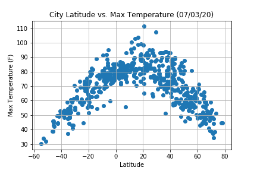
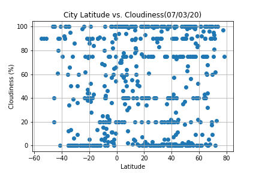

# "What's the weather like as we approach the equator?"

## Part I - WeatherPy
* Created a Python script to visualize the weather of 500+ cities across the world of varying distance from the equator

1. Scatter plots used to show the relationship between weather variables as follows:

2.  Linear regression used on each relationship, for Northern Hemisphere (greater than or equal to 0 degrees latitude) and Southern Hemisphere (less than 0 degrees latitude).

## Part II - VacationPy
 1. Created heatmap based on each city humidity.
 2. Created ideal weather condition based on temperature, windspeed and cloudiness.
 3. Used Google Places API to find the first hotel for each city located within 5000 meters of your coordinates.
 4. Plotted the hotels on top of the humidity heatmap with each pin containing the **Hotel Name**, **City**, and **Country**.

